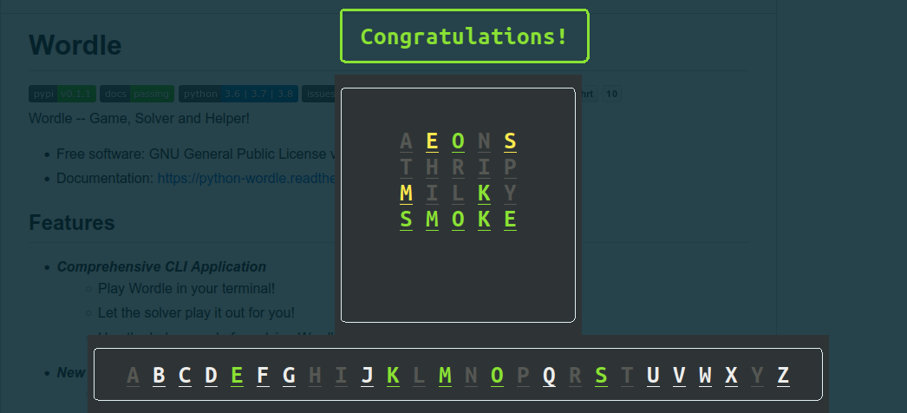

======
Wordle
======

.. image:: https://img.shields.io/pypi/v/python-wordle?color=success
        :target: https://pypi.python.org/pypi/python-wordle

.. image:: https://readthedocs.org/projects/python-wordle/badge/?version=latest
        :target: https://python-wordle.readthedocs.io/en/latest/?version=latest
        :alt: Documentation Status

.. image:: https://img.shields.io/pypi/pyversions/python-wordle
        :target: https://pypi.python.org/pypi/python-wordle
        :alt: Python Version Support

.. image:: https://img.shields.io/github/issues/hrishikeshrt/python-wordle
        :target: https://github.com/hrishikeshrt/python-wordle/issues
        :alt: GitHub Issues

.. image:: https://img.shields.io/github/followers/hrishikeshrt?style=social
        :target: https://github.com/hrishikeshrt
        :alt: GitHub Followers

.. image:: https://img.shields.io/twitter/follow/hrishikeshrt?style=social
        :target: https://twitter.com/hrishikeshrt
        :alt: Twitter Followers

Wordle -- Game, Solver and Helper!

* Free software: GNU General Public License v3
* Documentation: https://python-wordle.readthedocs.io.

Features
========

* Comprehensive CLI Application
    * Play Wordle in your terminal!
    * Let the solver play it out for you!
    * Use the helper mode for solving Wordles provided by other platforms!
* New Wordle every day.
    * **Disclaimer**: This has nothing to do with the NYTimes Wordle.
* Play more using :code:`--random` option.
* Reproducible random Wordle by specifying :code:`--seed`.
* :code:`WordleSolver()` class for solving Wordle.
* :code:`--solve` option to let :code:`WordleSolver()` do its work in front of your eyes!
* :code:`--helper` option to activate the helper mode for help with solving Wordles provided by other platforms.

Install
=======

To install, run this command in your terminal:

.. code-block:: console

    $ pip install python-wordle

Usage
=====

.. code-block:: console

    usage: wordle [-h] [--random] [--seed SEED] [--solve] [--helper]

    Wordle on your terminal

    optional arguments:
    -h, --help   show this help message and exit
    --random     Show a random Wordle
    --seed SEED  Seed the RNG
    --solve      Simulate WordleSolver
    --helper     Take help from WordleSolver for a Wordle in a different platform

Example
=======

Helper Session
--------------

.. code-block:: console

    Attempt 1
    =========

    Suggestions: [('kioea', 95.7343887423043)]
    Chosen word: aeons
    Obtained result: 01201
    Eliminated 15868 options.

    Attempt 2
    =========

    Suggestions: [('thrip', 78.0), ('thirl', 78.0)]
    Chosen word: thrip
    Obtained result: 00000
    Eliminated 39 options.

    Attempt 3
    =========

    Suggestions: [('blayk', 72.72727272727273), ('milky', 72.72727272727273), ('bulky', 72.72727272727273), ('lucky', 72.72727272727273), ('mckay', 72.72727272727273)]
    Chosen word: milky
    Obtained result: 10020
    Eliminated 10 options.

    Attempt 4
    =========

    Valid Words: {'smoke'}
    Suggestions: [('smoke', 0.0)]
    Chosen word: smoke
    Obtained result: 22222

    Congratulations!

Terminology
===========

All of the following terms are valid in the context of a specific Wordle.

* A set of **known letters** is a set of letters which are known to be present in the Wordle's word based on clues obtained from the previous attempts.
* A set of **valid words** at any given point refers to a set of words from vocabulary that are possible solutions to the Wordle at that point based on the clues obtained till then.
* A letter is said to **cover** a word if the letter belongs to that word.
* **Coverage** *(absolute)* of a word refers to the percentage of valid words (at that point) covered by the letters in that word.
* **Coverage** *(relative)* of a word refers to the percentage of valid words (at that point) covered by the set of

Solver
======

Solver roughly uses the following strategy,

* Guess a word with highest (relative) coverage.
* After each guess, eliminate words based on the clues, e.g.,
    * Remove all words that contain an :code:`incorrect-letter`
    * Remove all words that do not contain the identified :code:`(correct-letter, correct-position)` combinations
    * Remove all words that contain the identified :code:`(correct-letter, incorrect-position)` combinations
    * Remove all words that do not contain a :code:`correct-letter`
    * Re-calculate (relative) coverage and guess again
* If at any point, number of valid words drops below number of attempts left, guess the valid words one-by-one.
* Additionally, there are heuristics to choose a word if multiple words with best coverage-score exist.

Helper
======

Helper mode can be used to get assistance while solving Wordle from another provider.

* Suggestions for words will be provided at each step.
* You may choose a word and obtain result.
* Enter the obtained result as a ternary string, i.e., a string made of 0, 1, and 2.
    - 0 : (grey)   : an incorrect letter.
    - 1 : (yellow) : a correct letter in wrong position.
    - 2 : (green)  : a correct letter in correct position.
* e.g., if the third letter turned green and fifth letter turned yellow in the third party Wordle, then you should input 00201 as the result obtained.

Evaluation
==========

WordleSolver has been evaluated on the entire vocabulary.

Setup
-----

* Word Size: 5
* Vocabulary Size: 15918
* Maximum Attempts: 6

Performance
-----------

* Success Count: 15446
* Success Rate: 97.03 %
* Average Attempts: 4.58
